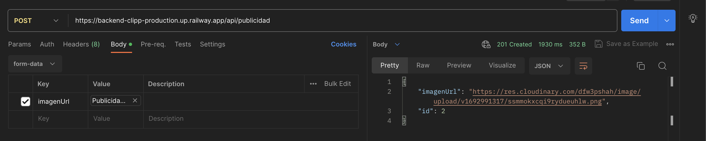
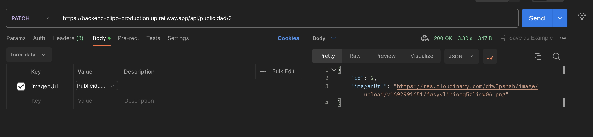
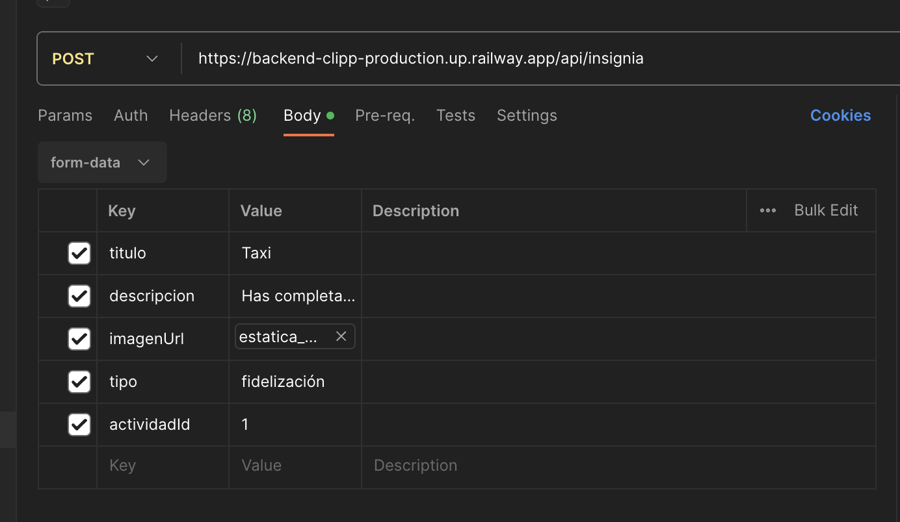
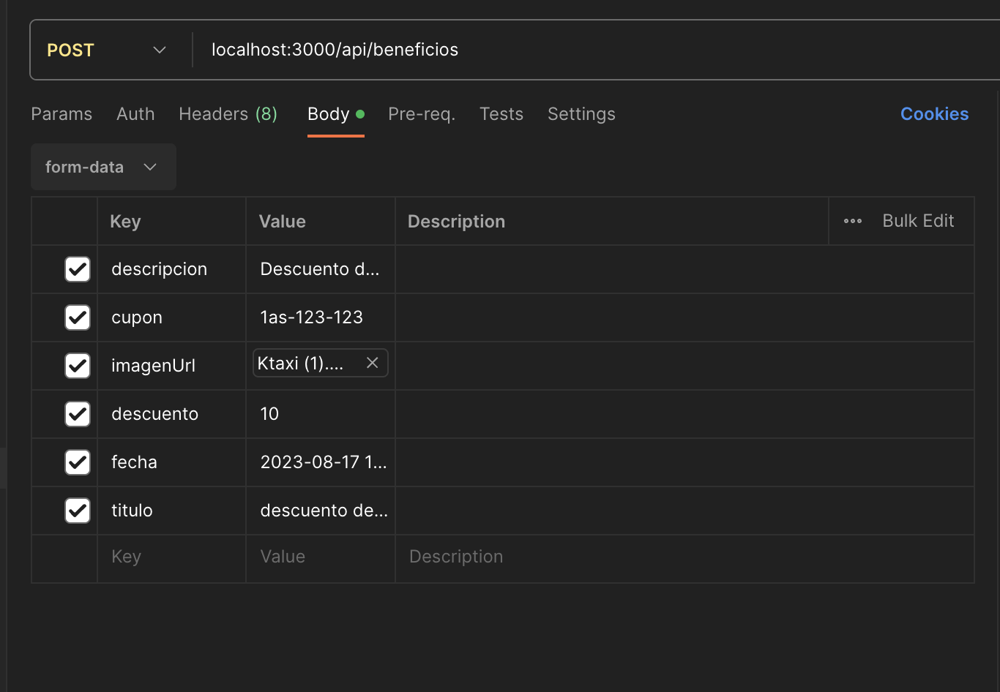
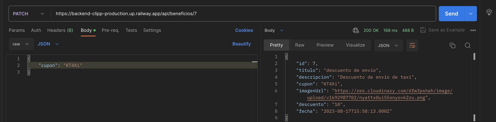
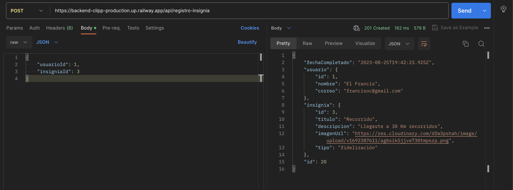
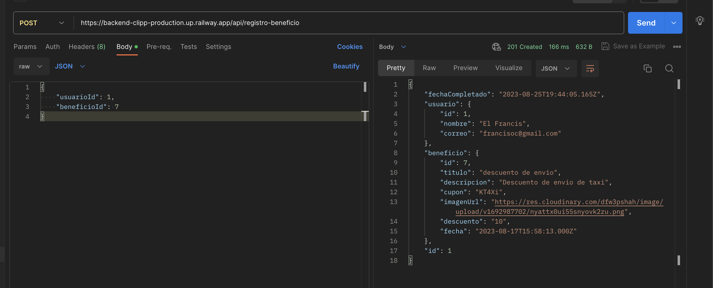

<p align="center">
  <a href="http://nestjs.com/" target="blank"></a>
</p>
## Endpoints API

### Usuarios

- **Crear Usuario**
  - Método: POST
  - Ruta: `/api/usuarios`
  - Cuerpo(Ejemplo):
    ```
    {
      "nombre": "Juan",
      "correo": "juan@example.com"
    }

    ```
  
- **Obtener todos los Usuarios**
  - Método: GET
  - Ruta: `/api/usuarios`
  - Ejemplo de lo que viene:
    ```
    [
      {
          "id": 1,
          "nombre": "El Francis",
          "correo": "francisoc@gmail.com",
          "insignias": [
              {
                  "id": 14,
                  "fechaCompletado": "2023-08-25T12:50:57.000Z"
              },
              {
                  "id": 10,
                  "fechaCompletado": "2023-08-25T14:31:47.000Z"
              }
          ],
          "registroActividad": [
              {
                  "id": 1,
                  "estado": false,
                  "progreso": 0,
                  "fechaCompletado": null
              },
              {
                  "id": 2,
                  "estado": false,
                  "progreso": 0,
                  "fechaCompletado": null
              },
              {
                  "id": 3,
                  "estado": false,
                  "progreso": 0,
                  "fechaCompletado": null
              },
              {
                  "id": 4,
                  "estado": false,
                  "progreso": 0,
                  "fechaCompletado": null
              },
              {
                  "id": 5,
                  "estado": false,
                  "progreso": 0,
                  "fechaCompletado": null
              },
              {
                  "id": 21,
                  "estado": false,
                  "progreso": 0,
                  "fechaCompletado": null
              }
          ]
      },
      {
          "id": 2,
          "nombre": "Xavi",
          "correo": "xavi@gmail.com",
          "insignias": [],
          "registroActividad": [
              {
                  "id": 6,
                  "estado": false,
                  "progreso": 0,
                  "fechaCompletado": null
              },
              {
                  "id": 7,
                  "estado": false,
                  "progreso": 0,
                  "fechaCompletado": null
              },
              {
                  "id": 8,
                  "estado": false,
                  "progreso": 0,
                  "fechaCompletado": null
              },
              {
                  "id": 9,
                  "estado": false,
                  "progreso": 0,
                  "fechaCompletado": null
              },
              {
                  "id": 10,
                  "estado": false,
                  "progreso": 0,
                  "fechaCompletado": null
              },
              {
                  "id": 22,
                  "estado": false,
                  "progreso": 0,
                  "fechaCompletado": null
              }
          ]
      },
      {
          "id": 3,
          "nombre": "Edgar",
          "correo": "edgar@gmail.com",
          "insignias": [
              {
                  "id": 11,
                  "fechaCompletado": "2023-08-25T09:35:04.000Z"
              }
          ],
          "registroActividad": [
              {
                  "id": 11,
                  "estado": false,
                  "progreso": 0,
                  "fechaCompletado": null
              },
              {
                  "id": 12,
                  "estado": false,
                  "progreso": 0,
                  "fechaCompletado": null
              },
              {
                  "id": 13,
                  "estado": false,
                  "progreso": 0,
                  "fechaCompletado": null
              },
              {
                  "id": 14,
                  "estado": false,
                  "progreso": 0,
                  "fechaCompletado": null
              },
              {
                  "id": 15,
                  "estado": false,
                  "progreso": 0,
                  "fechaCompletado": null
              },
              {
                  "id": 23,
                  "estado": false,
                  "progreso": 0,
                  "fechaCompletado": null
              }
          ]
      },
      {
          "id": 4,
          "nombre": "samuel",
          "correo": "samuel@gmail.com",
          "insignias": [],
          "registroActividad": [
              {
                  "id": 16,
                  "estado": false,
                  "progreso": 0,
                  "fechaCompletado": null
              },
              {
                  "id": 17,
                  "estado": false,
                  "progreso": 0,
                  "fechaCompletado": null
              },
              {
                  "id": 18,
                  "estado": false,
                  "progreso": 0,
                  "fechaCompletado": null
              },
              {
                  "id": 19,
                  "estado": false,
                  "progreso": 0,
                  "fechaCompletado": null
              },
              {
                  "id": 20,
                  "estado": false,
                  "progreso": 0,
                  "fechaCompletado": null
              },
              {
                  "id": 24,
                  "estado": false,
                  "progreso": 0,
                  "fechaCompletado": null
              }
          ]
      }
    ]
    ```
  
- **Obtener Usuario por ID**
  - Método: GET
  - Ruta: `/api/usuarios/:id`
  - Ejemplo de lo que viene:
  ```
  {
    "id": 1,
    "nombre": "El Francis",
    "correo": "francisoc@gmail.com"
  }
  ```
  
- **Actualizar Usuario**
  - Método: PATCH
  - Ruta: `/api/usuarios/:id`
  - Cuerpo (Ejemplo):
  ```
  {
    "nombre": "Xavier"
  }
  ```

  
- **Eliminar Usuario**
  - Método: DELETE
  - Ruta: `/api/usuarios/:id`

- **Obtener Todo por ID de Usuario**
  - Método: GET
  - Ruta: `/api/usuarios/todo/:id`
  - Ejemplo de lo que viene: 
  ```
  {
    "id": 1,
    "nombre": "El Francis",
    "correo": "francisoc@gmail.com",
    "insignias": [
        {
            "id": 1,
            "titulo": "Taxi",
            "descripcion": "Has completado 20 viajes en Taxis",
            "imagenUrl": "https://res.cloudinary.com/dfw3pshah/image/upload/v1692387523/b0jplmahxxv8scq4whc5.png",
            "tipo": "fidelización"
        },
        {
            "id": 2,
            "titulo": "Forma de pago",
            "descripcion": "Usaste una forma diferente de pago",
            "imagenUrl": "https://res.cloudinary.com/dfw3pshah/image/upload/v1692387567/jnfbva2uszmm10sn2oh4.png",
            "tipo": "fidelización"
        }
    ],
    "cupones": []
  }
  ```
  
- **Obtener Actividad por ID de Usuario**
  - Método: GET
  - Ruta: `/api/usuarios/actividad/:id`
  - Ejemplo de lo que viene:
  ```
  {
    "id": 1,
    "nombre": "El Francis",
    "correo": "francisoc@gmail.com",
    "registroActividad": [
        {
            "id": 1,
            "estado": false,
            "progreso": 0,
            "fechaCompletado": null,
            "actividad": {
                "id": 1,
                "nombre": "Pedido de taxis",
                "descripcion": "Completar 20 viajes en taxis",
                "total": 20,
                "insignias": [
                    {
                        "id": 1,
                        "titulo": "Taxi",
                        "descripcion": "Has completado 20 viajes en Taxis",
                        "imagenUrl": "https://res.cloudinary.com/dfw3pshah/image/upload/v1692387523/b0jplmahxxv8scq4whc5.png",
                        "tipo": "fidelización"
                    }
                ]
            }
        },
        {
            "id": 2,
            "estado": false,
            "progreso": 0,
            "fechaCompletado": null,
            "actividad": {
                "id": 2,
                "nombre": "Forma de pago",
                "descripcion": "Usar diferentes formas de pago",
                "total": 5,
                "insignias": [
                    {
                        "id": 2,
                        "titulo": "Forma de pago",
                        "descripcion": "Usaste una forma diferente de pago",
                        "imagenUrl": "https://res.cloudinary.com/dfw3pshah/image/upload/v1692387567/jnfbva2uszmm10sn2oh4.png",
                        "tipo": "fidelización"
                    }
                ]
            }
        },
        {
            "id": 3,
            "estado": false,
            "progreso": 0,
            "fechaCompletado": null,
            "actividad": {
                "id": 3,
                "nombre": "Kilometraje",
                "descripcion": "Alcanzar Kilometraje recorridos",
                "total": 9,
                "insignias": [
                    {
                        "id": 3,
                        "titulo": "Recorrido",
                        "descripcion": "Llegaste a 30 Km recorridos",
                        "imagenUrl": "https://res.cloudinary.com/dfw3pshah/image/upload/v1692387611/agbsik5jjve730tmpszp.png",
                        "tipo": "fidelización"
                    }
                ]
            }
        },
        {
            "id": 4,
            "estado": false,
            "progreso": 0,
            "fechaCompletado": null,
            "actividad": {
                "id": 4,
                "nombre": "Registar numero de telefono",
                "descripcion": "Hacer el registro del numero del telefono",
                "total": 1,
                "insignias": [
                    {
                        "id": 4,
                        "titulo": "Telefono",
                        "descripcion": "Validar número celular",
                        "imagenUrl": "https://res.cloudinary.com/dfw3pshah/image/upload/v1692387779/ysk2ghr6b2wzzszynh0z.png",
                        "tipo": "usabilidad"
                    }
                ]
            }
        },
        {
            "id": 5,
            "estado": false,
            "progreso": 0,
            "fechaCompletado": null,
            "actividad": {
                "id": 5,
                "nombre": "Tarjeta",
                "descripcion": "Agregar tarjeta crédito/debito",
                "total": 1,
                "insignias": [
                    {
                        "id": 5,
                        "titulo": "Tarjeta",
                        "descripcion": "Felicidades agregaste tu tarjeta ",
                        "imagenUrl": "https://res.cloudinary.com/dfw3pshah/image/upload/v1692387835/w4jyooqjkvc9ftgyzokz.png",
                        "tipo": "usabilidad"
                    }
                ]
            }
        },
        {
            "id": 21,
            "estado": false,
            "progreso": 0,
            "fechaCompletado": null,
            "actividad": {
                "id": 6,
                "nombre": "Pedido de delivery",
                "descripcion": "Hacer el pedido de almenos un delivery",
                "total": 20,
                "insignias": []
            }
        }
    ]
  }
  ```

### Actividades

- **Crear Actividad**
  - Método: POST
  - Cada vez que se crea las actividades. Se le asigna a cada usuario que se encuentra en la BDD.
  - Ruta: `/api/actividades`
  - Cuerpo(Ejemplo):
  ```
  {
    "nombre": "Pedido de taxis",
    "descripcion": "Completar 20 viajes en taxis",
    "total": 20
  }
  ```
  
- **Obtener todas las Actividades**
  - Método: GET
  - Ruta: `/api/actividades`
  - Ejemplo: 
  ```
  [
    {
        "id": 1,
        "nombre": "Pedido de taxis",
        "descripcion": "Completar 20 viajes en taxis",
        "total": 20
    },
    {
        "id": 2,
        "nombre": "Forma de pago",
        "descripcion": "Usar diferentes formas de pago",
        "total": 5
    },
    {
        "id": 3,
        "nombre": "Kilometraje",
        "descripcion": "Alcanzar Kilometraje recorridos",
        "total": 9
    },
    {
        "id": 4,
        "nombre": "Registar numero de telefono",
        "descripcion": "Hacer el registro del numero del telefono",
        "total": 1
    },
    {
        "id": 5,
        "nombre": "Tarjeta",
        "descripcion": "Agregar tarjeta crédito/debito",
        "total": 1
    },
    {
        "id": 6,
        "nombre": "Pedido de delivery",
        "descripcion": "Hacer el pedido de almenos un delivery",
        "total": 20
    }
  ]
  ```
  
- **Obtener Actividad por ID**
  - Método: GET
  - Ruta: `/api/actividades/:id`
  - Ejemplo: 
    ```
    {
      "id": 1,
      "nombre": "Pedido de taxis",
      "descripcion": "Completar 20 viajes en taxis",
      "total": 20
    }
    ```
  
- **Actualizar Actividad**
  - Método: PATCH
  - Ruta: `/api/actividades/:id`
  - Ejemplo: 
    ```
    {
      "nombre": "Pedir 10 taxis",
      "descripcion": "Hacer el pedido de 10 taxis"
    }
    ```
  
- **Eliminar Actividad**
  - Método: DELETE
  - Ruta: `/api/actividades/:id`

### Publicidad

- **Crear Publicidad**
  - Método: POST
  - Ruta: `/api/publicidad`
  - Ejemplo:
  
  Se sube el archivo de tipo file ya que es una iamgen puede ser .png o .jpg
- **Obtener toda la Publicidad**
  - Método: GET
  - Ruta: `/api/publicidad`
  - Ejemplo:
  ```
  [
    {
        "id": 2,
        "imagenUrl": "https://res.cloudinary.com/dfw3pshah/image/upload/v1692991317/ssmmokxcqi9rydueuhlw.png"
    }
  ]
  ```
  
- **Obtener Publicidad por ID**
  - Método: GET
  - Ruta: `/api/publicidad/:id`
  - Ejemplo:
    ```
    {
      "id": 2,
      "imagenUrl": "https://res.cloudinary.com/dfw3pshah/image/upload/v1692991317/ssmmokxcqi9rydueuhlw.png"
    }
    ```
  
- **Actualizar Publicidad**
  - Método: PATCH
  - Ruta: `/api/publicidad/:id`
    
  
- **Eliminar Publicidad**
  - Método: DELETE
  - Ruta: `/api/publicidad/:id`

### Insignias

- **Crear Insignia**
  - Método: POST
  - Ruta: `/api/insignias`
  - Ejemplo:
    
  
- **Obtener todas las Insignias**
  - Método: GET
  - Ruta: `/api/insignias`
  - Ejemplo:
  ```
  [
    {
        "id": 1,
        "titulo": "Taxi",
        "descripcion": "Has completado 20 viajes en Taxis",
        "imagenUrl": "https://res.cloudinary.com/dfw3pshah/image/upload/v1692387523/b0jplmahxxv8scq4whc5.png",
        "tipo": "fidelización",
        "actividad": {
            "id": 1,
            "nombre": "Pedido de taxis",
            "descripcion": "Completar 20 viajes en taxis",
            "total": 20
        }
    },
    {
        "id": 2,
        "titulo": "Forma de pago",
        "descripcion": "Usaste una forma diferente de pago",
        "imagenUrl": "https://res.cloudinary.com/dfw3pshah/image/upload/v1692387567/jnfbva2uszmm10sn2oh4.png",
        "tipo": "fidelización",
        "actividad": {
            "id": 2,
            "nombre": "Forma de pago",
            "descripcion": "Usar diferentes formas de pago",
            "total": 5
        }
    },
    {
        "id": 3,
        "titulo": "Recorrido",
        "descripcion": "Llegaste a 30 Km recorridos",
        "imagenUrl": "https://res.cloudinary.com/dfw3pshah/image/upload/v1692387611/agbsik5jjve730tmpszp.png",
        "tipo": "fidelización",
        "actividad": {
            "id": 3,
            "nombre": "Kilometraje",
            "descripcion": "Alcanzar Kilometraje recorridos",
            "total": 9
        }
    },
    {
        "id": 4,
        "titulo": "Telefono",
        "descripcion": "Validar número celular",
        "imagenUrl": "https://res.cloudinary.com/dfw3pshah/image/upload/v1692387779/ysk2ghr6b2wzzszynh0z.png",
        "tipo": "usabilidad",
        "actividad": {
            "id": 4,
            "nombre": "Registar numero de telefono",
            "descripcion": "Hacer el registro del numero del telefono",
            "total": 1
        }
    },
    {
        "id": 5,
        "titulo": "Tarjeta",
        "descripcion": "Felicidades agregaste tu tarjeta ",
        "imagenUrl": "https://res.cloudinary.com/dfw3pshah/image/upload/v1692387835/w4jyooqjkvc9ftgyzokz.png",
        "tipo": "usabilidad",
        "actividad": {
            "id": 5,
            "nombre": "Tarjeta",
            "descripcion": "Agregar tarjeta crédito/debito",
            "total": 1
        }
    }
  ]
  ```
  
- **Obtener Insignia por ID**
  - Método: GET
  - Ruta: `/api/insignias/:id`
  - Ejemplo:
    ```
    {
      "id": 1,
      "titulo": "Taxi",
      "descripcion": "Has completado 20 viajes en Taxis",
      "imagenUrl": "https://res.cloudinary.com/dfw3pshah/image/upload/v1692387523/b0jplmahxxv8scq4whc5.png",
      "tipo": "fidelización",
      "actividad": {
        "id": 1,
        "nombre": "Pedido de taxis",
        "descripcion": "Completar 20 viajes en taxis",
        "total": 20
      }
    }
    ```
  
- **Actualizar Insignia**
  - Método: PATCH
  - Ruta: `/api/insignias/:id`
  ```
  {
    "descripcion": "Has completado 5 viajes en Taxis"
  }
  ```
  
- **Eliminar Insignia**
  - Método: DELETE
  - Ruta: `/api/insignias/:id`

- **Obtener Insignias por ID de Usuario**
  - Método: GET
  - Ruta: `/api/insignias/usuario/:userId`
  - Ejemplo:
    ```
    [
    {
        "id": 1,
        "titulo": "Taxi",
        "descripcion": "Has completado 5 viajes en Taxis",
        "imagenUrl": "https://res.cloudinary.com/dfw3pshah/image/upload/v1692387523/b0jplmahxxv8scq4whc5.png",
        "tipo": "fidelización",
        "actividad": {
            "id": 1,
            "nombre": "Pedido de taxis",
            "descripcion": "Completar 20 viajes en taxis",
            "total": 20,
            "registros": [
                {
                    "id": 1,
                    "estado": false,
                    "progreso": 0,
                    "fechaCompletado": null,
                    "usuario": {
                        "id": 1,
                        "nombre": "El Francis",
                        "correo": "francisoc@gmail.com"
                    }
                }
            ]
        }
    },
    {
        "id": 2,
        "titulo": "Forma de pago",
        "descripcion": "Usaste una forma diferente de pago",
        "imagenUrl": "https://res.cloudinary.com/dfw3pshah/image/upload/v1692387567/jnfbva2uszmm10sn2oh4.png",
        "tipo": "fidelización",
        "actividad": {
            "id": 2,
            "nombre": "Forma de pago",
            "descripcion": "Usar diferentes formas de pago",
            "total": 5,
            "registros": [
                {
                    "id": 2,
                    "estado": false,
                    "progreso": 0,
                    "fechaCompletado": null,
                    "usuario": {
                        "id": 1,
                        "nombre": "El Francis",
                        "correo": "francisoc@gmail.com"
                    }
                }
            ]
        }
    },
    {
        "id": 3,
        "titulo": "Recorrido",
        "descripcion": "Llegaste a 30 Km recorridos",
        "imagenUrl": "https://res.cloudinary.com/dfw3pshah/image/upload/v1692387611/agbsik5jjve730tmpszp.png",
        "tipo": "fidelización",
        "actividad": {
            "id": 3,
            "nombre": "Kilometraje",
            "descripcion": "Alcanzar Kilometraje recorridos",
            "total": 9,
            "registros": [
                {
                    "id": 3,
                    "estado": false,
                    "progreso": 0,
                    "fechaCompletado": null,
                    "usuario": {
                        "id": 1,
                        "nombre": "El Francis",
                        "correo": "francisoc@gmail.com"
                    }
                }
            ]
        }
    },
    {
        "id": 4,
        "titulo": "Telefono",
        "descripcion": "Validar número celular",
        "imagenUrl": "https://res.cloudinary.com/dfw3pshah/image/upload/v1692387779/ysk2ghr6b2wzzszynh0z.png",
        "tipo": "usabilidad",
        "actividad": {
            "id": 4,
            "nombre": "Registar numero de telefono",
            "descripcion": "Hacer el registro del numero del telefono",
            "total": 1,
            "registros": [
                {
                    "id": 4,
                    "estado": false,
                    "progreso": 0,
                    "fechaCompletado": null,
                    "usuario": {
                        "id": 1,
                        "nombre": "El Francis",
                        "correo": "francisoc@gmail.com"
                    }
                }
            ]
        }
    },
    {
        "id": 5,
        "titulo": "Tarjeta",
        "descripcion": "Felicidades agregaste tu tarjeta ",
        "imagenUrl": "https://res.cloudinary.com/dfw3pshah/image/upload/v1692387835/w4jyooqjkvc9ftgyzokz.png",
        "tipo": "usabilidad",
        "actividad": {
            "id": 5,
            "nombre": "Tarjeta",
            "descripcion": "Agregar tarjeta crédito/debito",
            "total": 1,
            "registros": [
                {
                    "id": 5,
                    "estado": false,
                    "progreso": 0,
                    "fechaCompletado": null,
                    "usuario": {
                        "id": 1,
                        "nombre": "El Francis",
                        "correo": "francisoc@gmail.com"
                    }
                }
            ]
        }
    }
  ]
    ```
### Beneficios

- **Crear Beneficio**
  - Método: POST
  - Ruta: `/api/beneficios`
  - Ejemplo body:
    
  - La fecha debe estar en formato asi: 2023-08-17 15:58:12.887
  
- **Obtener todos los Beneficios**
  - Método: GET
  - Ruta: `/api/beneficios`
  - Ejemplo:
    ```
    [
      {
        "id": 7,
        "titulo": "descuento de envio",
        "descripcion": "Descuento de envio de taxi",
        "cupon": "1as-123-123",
        "imagenUrl": "https://res.cloudinary.com/dfw3pshah/image/upload/v1692987702/nyattx0ui55snyovk2zu.png",
        "descuento": "10",
        "fecha": "2023-08-17T15:58:13.000Z"
      }
    ] 
    ```
  
- **Obtener Beneficio por ID**
  - Método: GET
  - Ruta: `/api/beneficios/:id`
  - Ejemplo:
    ```
    {
      "id": 7,
      "titulo": "descuento de envio",
      "descripcion": "Descuento de envio de taxi",
      "cupon": "1as-123-123",
      "imagenUrl": "https://res.cloudinary.com/dfw3pshah/image/upload/v1692987702/  nyattx0ui55snyovk2zu.png",
      "descuento": "10",
      "fecha": "2023-08-17T15:58:13.000Z"
    }
    ```
  
- **Actualizar Beneficio**
  - Método: PATCH
  - Ruta: `/api/beneficios/:id`
  
  
- **Eliminar Beneficio**
  - Método: DELETE
  - Ruta: `/api/beneficios/:id`


### Registro de Insignia

- **Crear Registro de Insignia**
  - Método: POST
  - Ruta: `/api/registro-insignia`
  - Ejemplo:
    


### Registro de Beneficio

- **Crear Registro de Beneficio**
  - Método: POST
  - Ruta: `/api/registro-beneficio`
  - Ejemplo:
    
